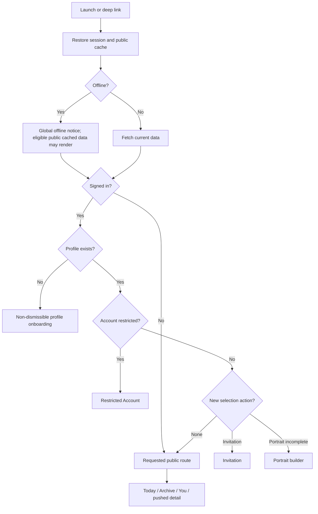
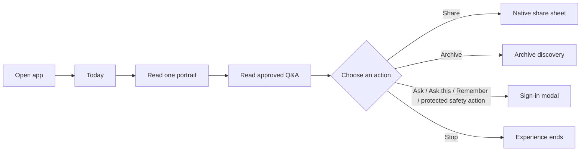
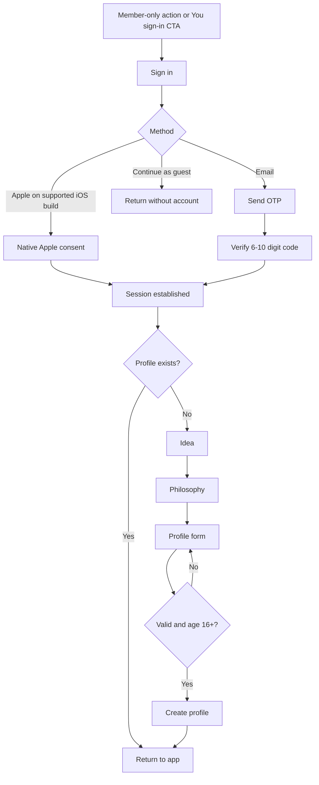
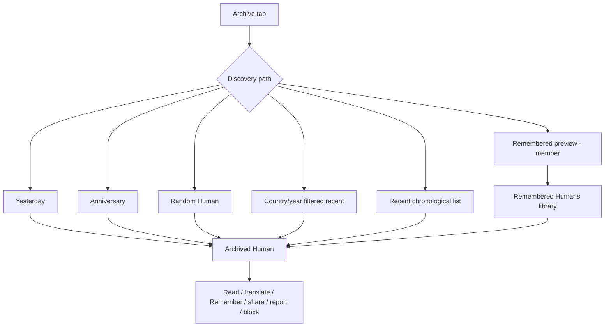
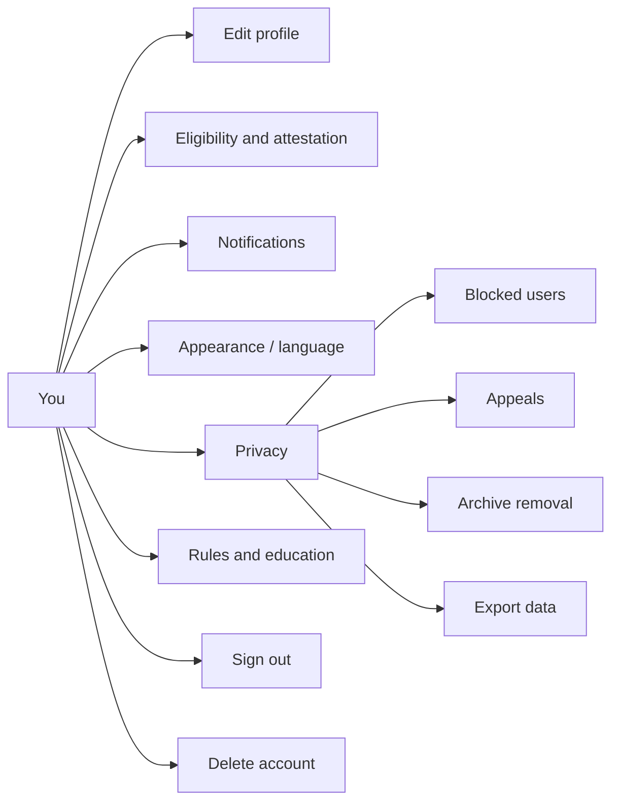

# Unumae user flows

This document maps **eight major implemented flows**. Solid steps describe current code, and the repository plus `PRODUCT_CONSTITUTION.md` define the product boundary.

## 1. App entry, route gates, and navigation

### CURRENT IMPLEMENTATION

The order matters: an authenticated profileless user is routed to onboarding; restricted account state overrides normal navigation; a time-sensitive selected-person action can surface after those checks. Public reading remains available without a session.

**Deep links and notifications**

- `onehuman://...` supports Expo Router paths.
- `https://unumae.app/human/{drawId}` and the `www` equivalent map to Human detail through iOS associated domains.
- `/today` is a stable redirect to Today.
- Daily notification → Today.
- Selected notification → Invitation; notification actions can accept/decline.
- Answered notification → the referenced Human when a draw id exists, otherwise Archive.
- Anniversary notification → the referenced Human when available, otherwise Archive.

## 2. Guest discovery and first meaningful action

### CURRENT IMPLEMENTATION

Step-by-step:

1. A guest launches directly into Today; there is no authentication wall.
2. Loading resolves to the live Human, Quiet Day, removed Human, or retryable error.
3. The guest reads the 4:5 portrait, seven guided responses, and approved questions/answers.
4. The guest can switch to available translation, share, or explore the Archive.
5. A member-only action opens Sign in. Cancel/“continue as guest” returns without losing public access.
6. Reaching the bottom is a valid end; there is no automatic next Human.

**First meaningful action:** for a guest, reading/sharing or opening one archived Human. For a new authenticated member, completing the profile and then Remembering, asking, voting, or opting into selection.

## 3. New member authentication and onboarding

### CURRENT IMPLEMENTATION

Profile form data: username, display name, immutable birth year, country, one or more languages, optional city, optional 160-character bio, locale, and an explicit yes/no selection-participation decision. Rules acceptance, sufficient account age/activity, stable provider assurance and device attestation are separate eligibility gates; completing onboarding alone does not guarantee entry into the draw.

## 4. Returning reader/member and Human interaction

### CURRENT IMPLEMENTATION

1. Session restoration and cache boundary prevent one account's private query state from leaking into another session.
2. Today loads. A `JourneyCard` appears if the account has a current selected-person action.
3. The reader can:
   - toggle original/translated portrait and question content;
   - propose an approved-before-publication question through a sheet;
   - toggle “Ask this” on a question;
   - Remember/forget the Human privately;
   - generate and share a visual card/link;
   - report a portrait/question/profile reason and optionally block its author.
4. Opening an Archive result navigates to `/human/[id]`; back returns to the originating stack context.
5. Archived questions are readable, but voting is disabled because their live cycle has ended.
6. Network loss shows the global banner; eligible public query data can render from the 24-hour persisted cache. Private lists/actions are not an offline queue.

`/human/[id]` is a published portrait for a selected cycle, not a general member-profile route. A design AI must preserve that distinction.

## 5. Archive and private memory

### CURRENT IMPLEMENTATION

- Archive pagination is cursor-based and initiated only by “Load earlier.”
- There is no popularity sort, recommendation rail, or infinite scroll.
- Remembered Humans are private and ordered by remembered time.
- A removed Human is not a broken link: the Archive retains a number/date tombstone while identity/content/photo are absent.

## 6. Selected Human journey

### CURRENT IMPLEMENTATION

```mermaid
stateDiagram-v2
    [*] --> AwaitingAcceptance: selected + notified
    AwaitingAcceptance --> PortraitDraft: accept within 12 hours
    AwaitingAcceptance --> [*]: decline or expire; no penalty
    PortraitDraft --> ContentReview: photo + at least 5 valid answers; submit
    ContentReview --> PortraitDraft: rejected / revise where allowed
    ContentReview --> Ready: moderator approves
    Ready --> Live: 00:00 UTC cycle start
    Live --> Live: answer approved questions selectively
    Live --> Archived: 24-hour UTC cycle ends
    Archived --> RemovalPending: former Human requests removal
    RemovalPending --> Tombstone: removal approved
```

Detailed interaction:

1. The primary candidate receives a notification and/or Journey gate. Invitation shows selection date and a live 12-hour acceptance deadline.
2. Decline returns to Today and carries no selection penalty. Expiry also does not ban or deprioritize the person.
3. Accept initializes or resumes the Portrait builder.
4. The selected Human chooses one photo from the photo library. The client crops/downscales it to 4:5 JPEG and uploads to private Storage.
5. Seven guided answers save individually using revision numbers. Submission requires a photo plus at least five answers of ten or more characters.
6. Submission moves to manual review. Nothing becomes public before approval.
7. Status communicates `await-review` or `await-live`; the selected person is not asked to continuously refresh.
8. During the one live UTC day, Answer Questions lists approved audience questions. The Human chooses what to answer and can update an answer.
9. At cycle end the portrait enters the Archive. It cannot be selected again.
10. The former Human retains the right to request Archive removal, producing a tombstone if approved.

## 7. Profile, preferences, privacy, and account lifecycle

### CURRENT IMPLEMENTATION

**Profile:** members edit display name, username, country, city, bio and languages. Birth year cannot be changed after creation.

**Eligibility:** the screen shows the binary result and each unmet gate. Participation is an explicit reversible switch. Device attestation can succeed, fail, or be sent to manual review.

**Notifications:** members enable native permission/token registration and independently set daily, selected, answered and anniversary categories. There are deliberately no engagement-bait notifications.

**Privacy/safety:** city can be hidden; the user can export all stored data through the native share sheet, review/unblock people, appeal eligible decisions and request removal of their own Archive entries.

**Deletion:** a destructive confirmation begins the flow. Recent authentication may be required; email accounts use an OTP path. Backend state progresses through requested, locked, Storage deletion, database deletion, Auth deletion and completed, or retryable failure/manual review. A published Human's Archive content is removed while the audit sequence remains.

**Restricted account:** suspended, banned and deletion-pending sessions are globally routed away from normal app use. Appeals, export and deletion rights remain available where applicable.

## 8. Moderation and operations

### CURRENT IMPLEMENTATION

1. A moderator opens the hidden/authorized Admin link from You.
2. The app verifies moderator status; nonmoderators see an explicit locked state.
3. Eight console tabs cover:
   - portrait review;
   - question review;
   - community reports and account/content actions;
   - account-assurance flags;
   - moderation appeals;
   - Archive-removal requests;
   - first-party product signals/funnels/retention/growth gates;
   - operational alerts, scheduled jobs, fairness balance and integrity signals.
4. Queue cards show the minimum context needed for a logged action. Mutations refresh relevant data and confirm with a toast.
5. Moderator actions include approve/reject, dismiss/remove, suspend/ban, clear/uphold, overturn, approve/decline removal, and resolve an alert.

This is an internal operational surface. Consumer design changes must still account for the states it creates: rejected content, removed Humans, restricted accounts, appeals and removal status.

## Design-AI flow boundary

### PRODUCT INTENT

The eight flows above are the current Unumae experience. Do not add conventional social-network journeys such as following people, joining communities, publishing impact posts or testimonies, browsing a feed, direct messaging, generic commenting, or collecting public engagement status. These are anti-invention constraints, not missing roadmap items.

The supported discovery paths are Today's Human, Yesterday, anniversaries, Random Human, country/year Archive filters, recent chronological entries, and the private Remembered library.
